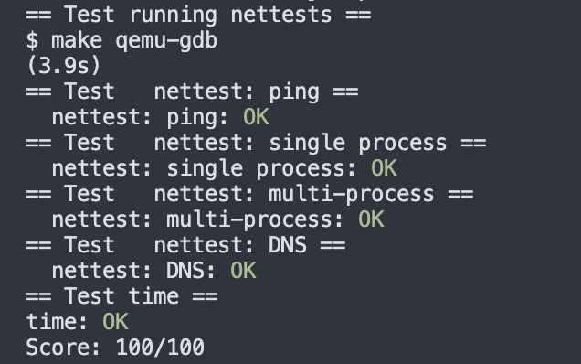

# Lab 11 networking 实验记录

lab link: https://pdos.csail.mit.edu/6.828/2020/labs/net.html

## 11.1 E100

### 1 要求

补全网卡驱动里的e1000_transmit()和e1000_recv()函数，使之能够接受发送数据packets。

这个task的自由度不高，细节主要跟着prompts和hints就可以实现。需要了解大致步骤&原理可以参考manual里的ch3。

### 2 实现

- 实现e1000_transmit()

首先获取当前的ring index以及对应的desc：

```c
int
e1000_transmit(struct mbuf *m)
{
  //
  // Your code here.
  uint32 end;
  struct tx_desc *desc;

  acquire(&e1000_lock);
  end = regs[E1000_TDT]; // cur desc id
  desc = &tx_ring[end]; // index into ring to get cur desc
  // ...
}
```

然后检查desc overflow。如果desc上设置好了E1000_TXD_STAT_DD，说明上一轮已经完成，可以释放buf里上一轮的内存。

```c
  // check overflow
  if (!desc->status & E1000_TXD_STAT_DD) {
    release(&e1000_lock);
    return -1;
  }

  // use mbuffree() to free the last mbuf
  if (tx_mbufs[end]) {
    mbuffree(tx_mbufs[end]);
  }
```

最后更新当前desc中的信息，更新ring index

```c
  desc->addr = (uint64) m->head;
  tx_mbufs[end] = m;
  desc->length = m->len;
  desc->cmd = E1000_TXD_CMD_EOP | E1000_TXD_CMD_RS;

  // update the ring position
  regs[E1000_TDT] = (end + 1) % TX_RING_SIZE;
  release(&e1000_lock);

  return 0;
```

- 实现e1000_recv()

```c
static void
e1000_recv(void)
{
  // ask the E1000 for the ring index
  int end = (regs[E1000_RDT] + 1) % RX_RING_SIZE;
  // get the next waiting received packet
  struct rx_desc *desc = &rx_ring[end];

  // check if a new packet is available
  while ((desc->status & E1000_RXD_STAT_DD)) {
    if(desc->length > MBUF_SIZE) {
      panic("e1000_resv");
    }

    // update the length reported in the descriptor
    rx_mbufs[end]->len = desc->length;

    // deliver the mbuf to the network stack
    net_rx(rx_mbufs[end]);     

    // allocate a new mbuf replace the one given to net_rx()
    rx_mbufs[end] = mbufalloc(0);
    if (!rx_mbufs[end]) {
      panic("e1000_resv");
    }

    // update descriptor and status
    desc->addr = (uint64) rx_mbufs[end]->head;
    desc->status = 0;
    
    end = (end + 1) % RX_RING_SIZE; // mod if exceeding ring size
    desc = &rx_ring[end];
  }

  regs[E1000_RDT] = (end - 1) % RX_RING_SIZE;
  //
  // Check for packets that have arrived from the e1000
  // Create and deliver an mbuf for each packet (using net_rx()).
  //
  
}
```


## Grade

