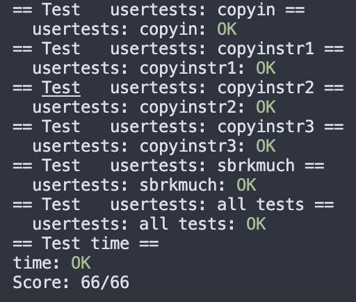

## Lab 3 pgtbl 实验记录

Lab网址：https://pdos.csail.mit.edu/6.828/2020/labs/pgtbl.html

课程主页：https://pdos.csail.mit.edu/6.828/2020/schedule.html

gdb用法：https://pdos.csail.mit.edu/6.1810/2022/labs/gdb.html

> 排雷提示：第一次学操作系统，且没有参考中文教材，以下内容可能会出现中英混杂、中文术语不准确等问题。

### 3.1 Print a page table

#### 1 具体要求

要求实现一个`vmprint()`函数，接受一个pagetable参数，按照要求的格式打印出这个pagetable。

```shell
# Print Format:
# page table [argument]
page table 0x0000000087f6e000
# [depth] [pte index]: [pagetable entry] pa [physical address]
..0: pte 0x0000000021fda801 pa 0x0000000087f6a000
.. ..0: pte 0x0000000021fda401 pa 0x0000000087f69000
.. .. ..0: pte 0x0000000021fdac1f pa 0x0000000087f6b000
```

#### 2 实现方法

这个task相关的知识点：

- VA, PA, PPN, PTE的构成、作用和它们之间的关系，比如
  - 虚拟地址（VA）中包括27bits，其中每9bits对应一个page table entry（PTE）
  - VA包含几个部分，其中27位（3*9）用于在各层页表中索引PTE，另有12位offset用来在PA中索引定位
  - 页表PTE中的PPN用来寻找下一层页表
- xv6页表的three-level tree结构 (xv6book, p.30-1)：
  - VA-PA转换的逻辑是：最上层页表的地址是由satp寄存器记录的；通过va中27bits里最左的9bits索引，查找到最上层的页表中对应的PTE；然后通过这个PTE中的PPN找到第二个页表，由VA中第二个9bits索引到对应的PTE，以此类推...最后再结合VA中的offset定位PA
  - VA-PA translation是由硬件memory management unit（MMU）实现的（如果没听错，lec里说软件也可以，但是硬件更快）
- 如何判断PPN映射到了下一层页表还是物理内存？
  - 参考`freewalk()`，如果`(pte & (PTE_R|PTE_W|PTE_X)) == 0`，即不可读/写/执行，就说明PPN没有映射到物理内存，而是映射到了更低层的页表

有三层pagetable，我选择了递归打印。这个task标了easy难度，跟着hints就能实现。代码如下：

```c
// helper function for vmprint
void
printhelper(pagetable_t pagetable, int depth)
{
  // there are 2^9 = 512 PTEs in a page table.
  for(int i = 0; i < 512; i++){
    pte_t pte = pagetable[i];
    // skip invalid pages
    if (!(pte & PTE_V)) {
      continue;
    }

    // print indentation
    for (int i = 0; i <= depth; i++) {
      printf("..");
      if(i != depth) {
        printf(" ");
      }
    }
    printf("%d: pte %p pa %p\n", i, pte, PTE2PA(pte));
      
  	// has lower-level pt -> recursive call on child
    if((pte & (PTE_R|PTE_W|PTE_X)) == 0){
      uint64 child = PTE2PA(pte);
      printhelper((pagetable_t)child, depth + 1);
    }
  }
}

// print the content of a page table
void
vmprint(pagetable_t pagetable)
{
  // refer to freewalk()
  printf("page table %p\n", pagetable);
  printhelper(pagetable, 0);
}
```


#### 3 结果

和要求print内容一致，test ok。


#### 4 问题&思考

最后有个challenge question问打印出来的page0、page1、page2里是什么。

因为vmprint是在`kernel/exec.c`中调用的，所以回去看`kernel/exec.c`里有分配页表的地方，源码上面有注释：

```c
...
    // 分配了1 page
    // Load program into memory. 那这个页表应该是data+text
if((sz1 = uvmalloc(pagetable, sz, ph.vaddr + ph.memsz)) == 0)
      goto bad;
...
    // 分配了2 pages
    // Allocate two pages at the next page boundary.
    // Use the second as the user stack.
      if((sz1 = uvmalloc(pagetable, sz, sz + 2*PGSIZE)) == 0)
    goto bad;
```

所以根据Figure3.4，这些应该是init user stack时分配的，page0是data+text，page1是guard page（PTE_V not set, 不可read/write），page2是顶上的stack。

### 3.2 A kernel page table per process

#### 1 要求

让每个进程都有一个自己的kernel pagetable，它们的页表和global kernel page保持一致。在切换进程时，也要切换到该进程对应的kernel pagetable（无进程运行时用global kernel pagetable。

和当前task相关的知识点：

- 每个进程维护一个页表的用户地址空间和一个页表的内核地址空间："Xv6 maintains one page table per process, describing each process’s user address space, plus a single page table that describes the kernel’s address space." (xv6book, p.31)
- Figure 3.3 内核地址空间里的映射关系（明白这点才知道之后如何构建kernel pagetable的mapping），里面哪些是直接映射、哪些不是（和后面的kstack有关）。
- 以及上面的页表结构，还会再次用到

#### 2 实现方法

和hints给的顺序基本一致：

- 声明kernel pagetable变量：在 `struct proc` 中增加变量`pagetable_t kpagetable`，由此每个process都有了自己的kpt

```c
// kernel/proc.h 结构体里增加一个变量

struct proc {
  // ... private
  pagetable_t kpagetable;      // (+) Kernel page table
}
```

- 仿照`kvminit` 写一个函数，用来创建kpagetable页表并构建映射：
  - 理解：要在分配进程（即`allocproc()`里）时，增加「给kpagetable分配内存」 -> 「直接映射到和global kernel pagetable相同物理地址」这些构建操作
  - 思路：这些功能在`kvminit`中已有类似实现，但是不能直接调用`kvminit`，因为它调用了`kvmmap()`，后者是用`mappages` direct map了<u>global kernel page</u>和对应的pa。这里是要map<u>各个进程的kernel page</u>和pa，所以需要另写一个和`kvmmap`类似、但是允许传入指定pagetable的函数，然后在构建kpagetable时调用。
  - 实现：

```c
// kernel/vm.c 实现一个类似kvmmap的函数

// +++++++以下都是新增的
// add a mapping to a given page table
void
uvmmap(pagetable_t pt, uint64 va, uint64 pa, uint64 sz, int perm)
{
  if(mappages(pt, va, sz, pa, perm) != 0)
    panic("uvmmap");
}

// 参考了kvminit,
// 把kvmmap换成了上面的uvm以自定义需要map的pagetable
// Create a kernel page table for a given process
pagetable_t
proc_kpagetable(struct proc *p)
{
  pagetable_t kpagetable = (pagetable_t) kalloc();
  memset(kpagetable, 0, PGSIZE);

  // uart registers
  uvmmap(kpagetable, UART0, UART0, PGSIZE, PTE_R | PTE_W);

  // virtio mmio disk interface
  uvmmap(kpagetable, VIRTIO0, VIRTIO0, PGSIZE, PTE_R | PTE_W);

  // CLINT
  uvmmap(kpagetable, CLINT, CLINT, 0x10000, PTE_R | PTE_W);

  // PLIC
  uvmmap(kpagetable, PLIC, PLIC, 0x400000, PTE_R | PTE_W);

  // map kernel text executable and read-only.
  uvmmap(kpagetable, KERNBASE, KERNBASE, (uint64)etext-KERNBASE, PTE_R | PTE_X);

  // map kernel data and the physical RAM we'll make use of.
  uvmmap(kpagetable, (uint64)etext, (uint64)etext, PHYSTOP-(uint64)etext, PTE_R | PTE_W);

  // map the trampoline for trap entry/exit to
  // the highest virtual address in the kernel.
  uvmmap(kpagetable, TRAMPOLINE, (uint64)trampoline, PGSIZE, PTE_R | PTE_X);

  return kpagetable;
}
// +++++++
```

```c
// kernel/proc.c 新增代码片段

// Look in the process table for an UNUSED proc.
// If found, initialize state required to run in the kernel,
// and return with p->lock held.
// If there are no free procs, or a memory allocation fails, return 0.
static struct proc*
allocproc(void)
{
  // ....
  // An empty user page table.
  p->pagetable = proc_pagetable(p);
  if(p->pagetable == 0){
    freeproc(p);
    release(&p->lock);
    return 0;
  }
    
  // +++++++++++
  // Create a kernel page table.
  p->kpagetable = proc_kpagetable(p); // 在这里调用
  if(p->kpagetable == 0){
    freeproc(p);
    release(&p->lock);
    return 0;
  }
  // +++++++++++
  // ....
}
```

- 在kpagetable的页表中添加kernel stack的映射：
  - 理解+思路：原本kernel stack的初始化是在启动时的`procinit()`里完成的。现在为了把它加进kpagetable的映射中，需要把整个初始化过程移动到创建kpagetable的地方——也就是`allocproc()`中。
  - 实现：

```c
// kernel/proc.c 移动代码

// initialize the proc table at boot time.
void
procinit(void)
{
  struct proc *p;
  
  initlock(&pid_lock, "nextpid");
  for(p = proc; p < &proc[NPROC]; p++) {
      initlock(&p->lock, "proc");
	  // ----- 这里注释/删除掉原本的kstack初始化
  }
  kvminithart();
}

static struct proc*
allocproc(void)
{
  // ++++++++上面删掉的代码移动到这里
  // Allocate a page for the process's kernel stack.
  // Map it high in memory, followed by an invalid
  // guard page.
  char *pa = kalloc();
  if(pa == 0)
    panic("kalloc");
  // get kstack va
  uint64 va = KSTACK((int)(p - proc));
  // map kernal pagetable with kernal stack <- 这里构建映射
  uvmmap(p->kpagetable, va, (uint64)pa, PGSIZE, PTE_R | PTE_W);
  // 把va存在proc结构里
  p->kstack = va;
  // ++++++++++

  // Set up new context to start executing at forkret,
  // which returns to user space.
  memset(&p->context, 0, sizeof(p->context));
  p->context.ra = (uint64)forkret;
  p->context.sp = p->kstack + PGSIZE;

  return p;
}
```

- 修改进程调度函数 `scheduler()` ：
  - 理解：（1）在切换进程时，把对应的kpagetable加载到satp寄存器，并清除缓存[*否则会导致错误的mapping被留着继续用]（2）没有进程运行时用global  `kernel_pagetable`
  - 思路：参考`kvminithart()`函数，它实现了把global kernel pagetable加载到satp以及清除缓存。只要页表改成`proc->kpagetable`即可
  - 实现：

```c
// kernel/proc.c 修改调度函数
void
scheduler(void)
{
  // ...
  for(;;){
    // Avoid deadlock by ensuring that devices can interrupt.
    intr_on();

    int found = 0;
    // use kernel_pagetable when no process is running
    if(found==0){
      kvminithart(); // ++++ 无进程时使用global kernel pt
    }
    for(p = proc; p < &proc[NPROC]; p++) {
      acquire(&p->lock);
      if(p->state == RUNNABLE) {
        // Switch to chosen process.  It is the process's job
        // to release its lock and then reacquire it
        // before jumping back to us.
        p->state = RUNNING;
        c->proc = p;
        w_satp(MAKE_SATP(p->kpagetable));  // ++++++
        sfence_vma(); 			    	   // ++++++
        // 在跳进进程之前，就要完成satp的切换
        swtch(&c->context, &p->context); 

        // ...
    }
// ...
  }
}
```

- 在`freeproc()`中增加释放kstack和kpagetable内存的操作
  - 理解：要求清除kpagetable中的所有映射，但是不能动物理内存，否则会影响global kernel pagetable（毕竟它们的va直接映射到了同一物理内存上）；kstack是process-specific的，可以全部清除
  - 思路：关于kpagetable，参考`freewalk() `写一个函数，遍历三层pagetable，对有效pte进行递归释放；如果pagetable直接映射到了物理内存就不递归。至于kstack，直接调用已有方法`uvmumap()`就可以清除映射。

```c
// kernel/proc.c 增加函数

//++++++
// Free a process's page table without
// freeing the physical memory it refers to
void
proc_freepagetable_vonly(pagetable_t kpagetable)
{
  // there are 2^9 = 512 PTEs in a page table.
  for(int i = 0; i < 512; i++){
    pte_t pte = kpagetable[i];
    if(pte & PTE_V) 
      kpagetable[i] = 0;
    // 只有当映射到了下一层页表时，才会继续递归
    if((pte & PTE_V) && (pte & (PTE_R|PTE_W|PTE_X)) == 0){
      // this PTE points to a lower-level page table.
      uint64 child = PTE2PA(pte);
      proc_freepagetable_vonly((pagetable_t)child);
    }
  }
  kfree((void*)kpagetable);
}
//++++++
```

```c
// kernel/proc.c 对freeproc的改动如下

// free a proc structure and the data hanging from it,
// including user pages.
// p->lock must be held.
static void
freeproc(struct proc *p)
{
  // ...
  p->killed = 0;
  p->xstate = 0;
  // ++++ 以下新增
  if(p->kstack){
    // 第四个参数do_free设置为1 即为同时释放物理内存
    uvmunmap(p->kpagetable, p->kstack, 1, 1); 
  }
  p->kstack = 0;
    
  if(p->kpagetable)
    proc_freepagetable_vonly(p->kpagetable);
  p->kpagetable = 0;
  // +++++ 以上新增
  p->state = UNUSED;
}
```

- 彩蛋：修改`kvmpa()`函数
  - 理解：似乎是初始化disk时需要调用kvmpa，但是这个函数中目前`walk`的是global kernel pagetable，需要改成proc的kpagetable。
  - 实现：

```c
// kernel/vm.c

// translate a kernel virtual address to
// a physical address. only needed for
// addresses on the stack.
// assumes va is page aligned.
uint64
kvmpa(pagetable_t kpagetable, uint64 va) // 签名加了页表的参数
{
  uint64 off = va % PGSIZE;
  pte_t *pte;
  uint64 pa;
  
  pte = walk(kpagetable, va, 0); // 这里修改成kpagetable
  if(pte == 0)
    panic("kvmpa");
  if((*pte & PTE_V) == 0)
    panic("kvmpa");
  pa = PTE2PA(*pte);
  return pa+off;
}
```

```c
// 然后再跟着报错，
// 把调用这个kvmpa的地方传入 myproc()->kpagetable

// kernel/virtio_disk.c
  disk.desc[idx[0]].addr = (uint64) kvmpa(myproc()->kpagetable, (uint64) &buf0);
```

其他注意：

- 添加函数后注意在def.h中更新声明
- 可以修改`kernel/vm.c` and `kernel/proc.c`，但不要动测试相关的代码
- debug比较累

#### 3 结果

tesk全部ok

#### 4 问题

- 有两个我觉得比较tricky的地方
  - freeproc的实现，主要是要理解释放内存的范围，然后找/写对应的函数
  - hints里没有提到的`kvmpa()`函数。在完成所有hints后make qemu会出现panic：kvmpa的报错，这个函数的调用链不是特别清楚。

### 3.3 Simplify `copyin/copyinstr`

#### 1 要求

用`vmcopy.c`中给出的新函数`copyin_new`和`copyinstr_new`简化原有的`copyin`和`copyinstr`。

#### 2 分析

涉及到的知识点：

- user address space和kernel address space（xv6book, p.32-36）
  - kernel data和user data的起始虚拟地址不同
  - 它们和物理地址的映射关系（kernel space中部分是direct-mapped的）
- address space和pagetable的关系
  - 地址空间是一个抽象概念，它表示了一个进程的虚拟地址的范围
  - 页表是实际用于将这些虚拟地址映射到物理地址的数据结构

然后简单分析一下task：

原先由于global kernel pt里没有记录每个进程的用户地址空间的mapping，所以copyin在接受user的虚拟地址后，需要在软件中`walk`页表把虚拟地址转换成物理，然后才能从物理地址拷贝指定大小的内存到目标位置。

现在我们每个进程都有自己的`kpagetable`，所以只要把用户地址空间的mapping也记录进来就能一定程度上简化步骤。为此需要把进程用户地址空间里的pte拷贝到`kpagetable`里。

为什么可以记录进来？这和user space和kernel space的分布有关。kernel启动后的最低地址在PLIC（`0xC000000`），而user是从0开始的，它们的虚拟地址范围不重合，所以可以直接把user space的mapping直接加到（kernel自己不用的）kernel space里。

#### 3 实现

主要新写一个函数，用来把user pagetable拷贝到kpagetable里。

- 简化copyin

```c
// kernel/vm.c 修改函数

// Copy from user to kernel.
// Copy len bytes to dst from virtual address srcva in a given page table.
// Return 0 on success, -1 on error.
int
copyin(pagetable_t pagetable, char *dst, uint64 srcva, uint64 len)
{
 return copyin_new(pagetable, dst, srcva, len); // ++
}
```

- 写一个从uvm拷到kvm里的函数

```c
// kernel/vm.c 新增函数uvm2kvm

// copy uvm to kvm from START to END,
// return 0 if successfull and -1 otherwise
int
uvm2kvm(pagetable_t upgtbl, pagetable_t kpgtbl, uint64 start, uint64 end)
{
  // pointers to user pte and kernel pte
  // as walk() returns pointers
  pte_t *upte, *kpte;

  // exception: exceed plic limit
  if(end < start || PGROUNDUP(end) >= PLIC)
    return -1;

  // walk through every pte
  for(uint64 va = PGROUNDUP(start); va < end; va += PGSIZE){
    // look up user pte
    if ((upte = walk(upgtbl, va, 0)) == 0) {
      panic("uvm2kvm: failed to find user pte");
    }
    // look up kernel pte
    if ((kpte = walk(kpgtbl, va, 1)) == 0) {
      panic("uvm2kvm: failed to create kernel pte");
    }

    // add mapping
    // and cancelling user accessibility meanwhile
    *kpte = *upte & (~PTE_U); // set the user flag to 0 (forbid user access)
    
  }

  return 0;
}
```

- 修改所有可能会改动/初始化user mapping的函数，包括`fork()`, `exec()`, `growproc()`, `userinit()`

在改动后需重新把user pagetable拷贝进kpagetable

```c
// kernel/proc.c 修改fork & growproc & userinit

int
fork(void)
{
  // ... 
  np->sz = p->sz;

  // copy user addr space into kernel space
  // 注意是从newprocess的pagetable拷
  if ((uvm2kvm(np->pagetable, np->kpagetable, 0, np->sz)) < 0){
    freeproc(np);
    release(&np->lock);
    return -1;
  }

  np->parent = p;
  // ...
}

// Grow or shrink user memory by n bytes.
// Return 0 on success, -1 on failure.
int
growproc(int n)
{
  uint sz;
  struct proc *p = myproc();

  sz = p->sz;
  if(n > 0){
    if((sz = uvmalloc(p->pagetable, sz, sz + n)) == 0) {
      return -1;
    }
    // ++++ mem grow了，重新map一次
    if(uvm2kvm(p->pagetable, p->kpagetable, p->sz, sz) < 0) {
      return -1;
    }
  } else if(n < 0){
    sz = uvmdealloc(p->pagetable, sz, sz + n);
    // ++++ mem shrink了，只清除映射 不动物理内存
  	if (n >= PGSIZE) {
  		uvmunmap(p->kpagetable, PGROUNDUP(sz), n/PGSIZE, 0);
    }
  }
  
  p->sz = sz;
  return 0;
}

void
userinit(void)
{
  // ...
  // allocate one user page and copy init's instructions
  // and data into it.
  uvminit(p->pagetable, initcode, sizeof(initcode));
  p->sz = PGSIZE;

  // 在pagetable init完成之后
  uvm2kvm(p->pagetable, p->kpagetable, 0, p->sz); // +++

  // ...
}
```

```c
// kernel/exec.c 修改exec

int
exec(char *path, char **argv)
{
  // ...
  // （位置在进程页表初始化完之后）
  // copy user pagetable to kernel
  if(uvm2kvm(pagetable, p->kpagetable, 0, sz) < 0)
    goto bad;
  // ...
}
```

- 确认copyin没问题了，相似方法修改copyinstr

```c
// kernel/vm.c 修改函数copyinstr

int
copyinstr(pagetable_t pagetable, char *dst, uint64 srcva, uint64 max)
{
  return copyinstr_new(pagetable, dst, srcva, max); // +++
}
```

#### 4 结果

tests ok

### FINAL：tests&grade



## 参考

https://clownote.github.io/2021/03/11/xv6/Xv6-Lab-page-tables/

https://blog.csdn.net/LostUnravel/article/details/121340933