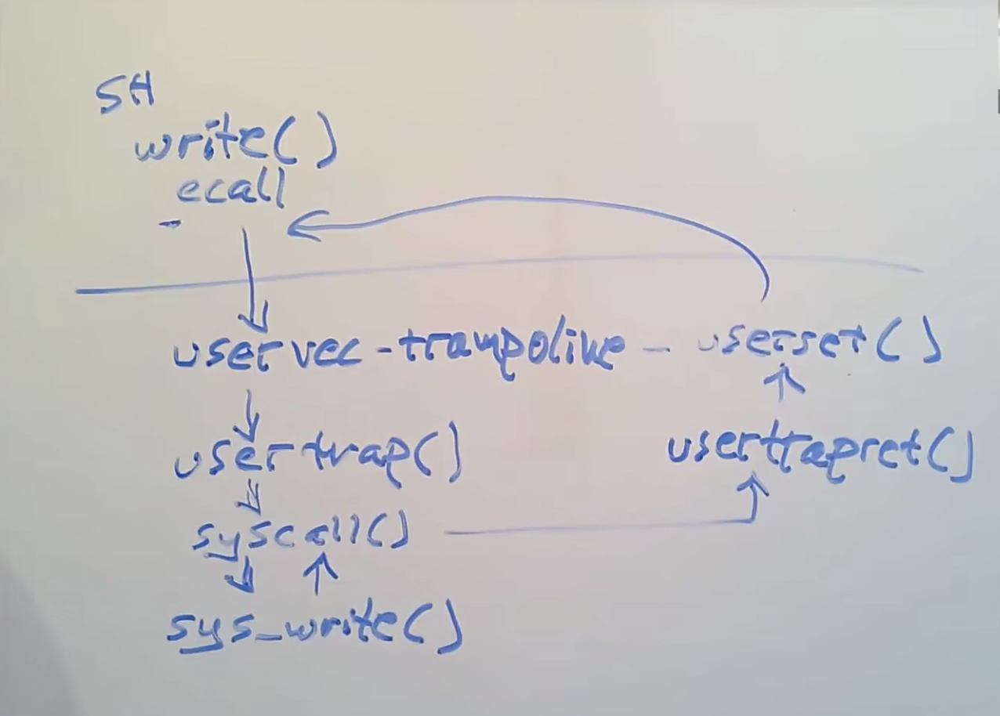

# Lab 4 traps 实验记录

课上的截图，对理解trap很有帮助：high-level picture of the procedure of switching from user mode to supervisor mode



## 4.2 Backtrace

### 1 要求

实现backtrace()函数，打印当前stack中的函数调用位置

### 2 实现

跟着hints一步步实现:

主要函数如下，除此以外还需要声明函数、在指定位置调用etc.

```c
// kernel/printf.c
void
backtrace()
{
  // // read the current frame pointer
  uint64 curfp = r_fp();
  uint64 begin = PGROUNDDOWN(curfp);
  uint64 end = PGROUNDUP(curfp);

  // while curfp still in range of stack
  while(curfp >= begin && curfp < end) {
    // print frame
    printf("%p\n", *(uint64 *)(curfp - 8));

    // get prev fp
    // be careful with pointers!
    curfp = *((uint64 *) (curfp - 16));
  } 
}

// also modified kernel/defs.h, kernel/riscv.h,
// kernel/sysproc.c
```


### 3 reflection

循环里的逻辑是打印frame pointer - 8位置的return addr -> 更新frame pointer为其指向的prev frame pointer -> 循环直到超出范围。

唯一一个卡手点在pointer casting那里（可见我写C真的不熟练、）。

## 4.3 Alarm

### 1 要求

通过实现两个syscall--`sigalarm(interval, handler)`和`sigreturn()`，实现对进程的定时警报。`sigalarm(interval, handler)`使得每隔intervel数量的硬件ticks，会触发一次handler函数来进行警报。

### 2 实现

instruction里分了两部分。

第一部分先实现（sigalarm中初始化警报相关参数 -> 在tick数量达到interval的要求时，触发第一次警报）。实现方法是在usertrap()（`kernel/trap.c`）中，在当前进程累计tick数达`interval`时，把`handler`装进trapframe的epc中。这样在返回user program时就会首先执行epc里的函数。

```c
// 先写sigalarm函数 初始化警报参数
uint64
sys_sigalarm(void)
{
  int interval;
  uint64 handler;

  // get interval a0
  if(argint(0, &interval) < 0)
    return -1;
  
  // get pointer to the handler function
  if(argaddr(1, &handler) < 0)
    return -1;
  
  // put it into the struc of myproc()
  myproc()->alarm_handler = handler;
  myproc()->interval = interval;
  // myproc()->numticks = 0;

  return 0;
}
```

```c
void
usertrap(void)
{
  int which_dev = 0;
  // ...
  // give up the CPU if this is a timer interrupt.
  if(which_dev == 2) {
    p->numticks++;
    if( p->interval > 0 && p->numticks == p->interval){
      // save the current trapframe bf overwriting
      p->tpcopy = *(p->trapframe);

      // put the handler func into the program counter
      // user will exec this func after returning
      p->trapframe->epc = p->alarm_handler;
    }
    yield();
  }
  usertrapret();
}
```

但这样直接写进epc会导致原epc被覆盖，同时许多原进程保存在寄存器的内容也会在执行handler函数时被覆盖，所以第二部分中要用sigreturn()来解决这个问题。instr里已经指定了sigreturn()的作用，它会在traphandler结束时被调用，专门用来恢复原进程内容。

关于怎么恢复原进程，lab instr里的推荐做法（似乎）是在覆盖epc前，保存相关的寄存器。根据riscv convention我猜测至少需要保存所有的argument/pointer/save reg以及几个特殊寄存器。

但这样好像有点麻烦，更加直接（？）的解决方式是覆盖前直接拷贝一份进程的trapframe放一边，再在需要恢复时拷回来。

第三部分（第三个test）要求handler在没有返回前，不可以再次被调用。这里稍微卡了下，后来发现只要用tick计数就可以控制：目前累计ticks在只有在达到`interval`时会触发`handler`，也就是说只要累计ticks没有被重置，handler就只会被触发一次。利用这点，我们只在`sigreturn`中重置累计ticks，这样就等同于“在调用sigreturn（即handler结束）之前，不会有再次调用发生“。

主要代码是这些：

```c
// usertrap()中加一句
if( p->interval > 0 && p->numticks == p->interval){
      // save the current trapframe bf overwriting
      p->tpcopy = *(p->trapframe); // +++++++tpcopy是在proc.h中声明的新参数

      // put the handler func into the program counter
      // user will exec this func after returning
      p->trapframe->epc = p->alarm_handler;
    }
```

```c
uint64
sys_sigreturn(void)
{
  // 把trapframe恢复成进入handler前的样子
  *(myproc()->trapframe) = myproc()->tpcopy;
  // 重置计数器 由此只有当一次handler call结束后才可能有下一次alarm
  myproc()->numticks = 0;
  return 0;
}
```

其他还有一堆syscall声明相关的修改，跟之前的syscall lab差不多。

### 3 思考

这个task中最关键的是理解trap的流程和riscv中相关寄存器的作用。

## Grade

