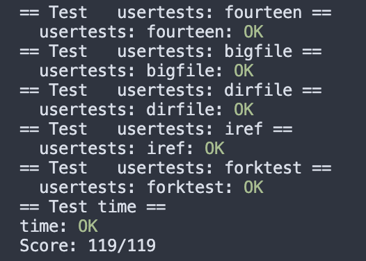

# Lab 5 lazy 实验记录

Lab lazy page allocation要求：https://pdos.csail.mit.edu/6.828/2020/labs/lazy.html

## 5.1 Eliminate allocation from sbrk()

### 1 要求

在syscall sbrk中删除即时分配内存的部分。

### 2 实现

把原函数中调用growproc的部分注掉，再增加proc sz即可，diff如下：

```c
diff --git a/kernel/sysproc.c b/kernel/sysproc.c
index e8bcda9..a410cd5 100644
--- a/kernel/sysproc.c
+++ b/kernel/sysproc.c
@@ -47,8 +47,9 @@ sys_sbrk(void)
   if(argint(0, &n) < 0)
     return -1;
   addr = myproc()->sz;
-  if(growproc(n) < 0)
-    return -1;
+  myproc()->sz += n;
+  // if(growproc(n) < 0)
+  //   return -1;
   return addr;
 }
```

如果最后报错为page fault（`unexpected scause 0x000000000000000f`）就对了。

### 3 reflection

这是实现lazy allocation的第一步。增加size相当于给proc开空头支票，所有内存面额增长，但实际还没有映射到物理内存。下一部分才处理proc真的需要使用内存的情况。

## 5.2 Lazy Allocation

### 1 要求

要求修改`trap.c`以处理上一部分引起的page fault，需要给报错的虚拟地址分配对应的物理内存页。

### 2 实现

首先在`usertrap()`中增加应对page fault的代码，总的来说是判断page fault -> 分配内存 -> 映射地址三步。

1. 根据hints，r_scause()可以用来判断是否pagefault。
2. 需要分配内存的虚拟地址就是报错的地址，可以用r_stval()找到。此处的虚拟地址需要再rounddown对齐到page boundary。
3. 然后参考vm.c中的uvmalloc()，用kalloc分配物理内存，mappages把处理过的虚拟地址映射到物理内存

```c
// kernel/trap.c - usertrap()
// ...
} else if((which_dev = devintr()) != 0){
    // ok
  } else if(r_scause() == 13 || r_scause() == 15) { // +++++
    // if pagefault
    // get the page boundary
    uint64 addr = PGROUNDDOWN(r_stval());
    // alloc memory
    char *mem = kalloc();
    if(mem == 0){
      printf("usertrap: failed to alloc mem\n");
    }
    memset(mem, 0, PGSIZE);
    if(mappages(p->pagetable, addr, PGSIZE, (uint64)mem, PTE_W|PTE_X|PTE_R|PTE_U) != 0){
      kfree(mem);
      printf("usertrap: failed to mappages\n");
    }

  } else {
    printf("usertrap(): unexpected scause %p pid=%d\n", r_scause(), p->pid);
    // ...
  }


```

到这里再次`echo hi`，不出意外会出现panic:uvmunmap not mapped的报错。看一下uvmunmap的代码就会发现，这个报错说明我们在取消虚拟地址和物理内存之间的映射时发现va对应了无效的pte。在实现lazy allocation前不可能有这种情况，所以被认为是错误。但现在lazy alloc的模式里遇到空头支票pte是正常的，所以可以放心地把报错删掉。

```c
// kernal/vm.c
void
uvmunmap(pagetable_t pagetable, uint64 va, uint64 npages, int do_free)
{
    // ...
    if((*pte & PTE_V) == 0)
      continue; // ++++ normal for lazy alloc
    if(PTE_FLAGS(*pte) == PTE_V)
	// ...
}
```

最后echo hi不报错就算通过。

### 3 小结

现在lazy alloc的核心部分完成了（甚至就只需要这么几行）。下一部分还需要处理这个改动波及到的其他原有功能。

## 5.3 Lazytests and Usertests

### 1 要求

修改代码以通过提供的压力测试&原功能测试。hints如下：

- Handle negative sbrk() arguments.
- Kill a process if it page-faults on a virtual memory address higher than any allocated with sbrk().
- Handle the parent-to-child memory copy in fork() correctly.
- Handle the case in which a process passes a valid address from sbrk() to a system call such as read or write, but the memory for that address has not yet been allocated.
- Handle out-of-memory correctly: if kalloc() fails in the page fault handler, kill the current process.
- Handle faults on the invalid page below the user stack.


### 2 实现

其他几个都比较简单，只需要简单加条件/加一行kill（具体看后面的diff）。有一个比较隐秘的：

- Handle the case in which a process passes a valid address from sbrk() to a system call such as read or write, but the memory for that address has not yet been allocated.

还没处理这个问题时，有个usertest会失败：`test sbrkarg: sbrkarg: write sbrk failed FAILED`

为此看了下test里报错位置的函数调用链，似乎是这样write -> sys_write -> filewrite -> pipewrite -> copyin -> walkaddr/memmove。于是初步判断问题出在最后几个函数（主要是没找到usertests的正确对单debug方法，不然还是gdb判断更快）。又因为问题必然是出在va没有对应的pa上，所以锁定在了walkaddr函数，而不会是memmove。

再看walkaddr，显然是还需要处理下pte invalid的情况，报错似乎是在pte2pa这一步发生的（因为lazy alloc下会出现空头pte）。在保证这个pte在有效范围内的前提下，再次分配物理内存即可。以下的`lazyalloc`是把上一部分usertrap中的片段单独抽成一个函数，方便调用。

```c
uint64
walkaddr(pagetable_t pagetable, uint64 va)
{
  pte_t *pte;
  uint64 pa;

  if(va >= MAXVA)
    return 0;

  pte = walk(pagetable, va, 0);
  // 这里以下修改了+++++
  if(pte == 0 || (*pte & PTE_V) == 0) {
    // make sure the va is ACTUALLY valid
    if (va >= PGROUNDUP(myproc()->trapframe->sp) && va < myproc()->sz) {
      // lazy alloc
      lazyalloc(va);
    } else {
      return 0;
    }
  }
  if((*pte & PTE_U) == 0)
    return 0;
  pa = PTE2PA(*pte);
  return pa;
}
```

其他部分：

```c
// 加了一个lazyalloc函数
diff --git a/kernel/defs.h b/kernel/defs.h
index 4b9bbc0..5dd45a6 100644
--- a/kernel/defs.h
+++ b/kernel/defs.h
@@ -171,6 +171,7 @@ uint64          walkaddr(pagetable_t, uint64);
 int             copyout(pagetable_t, uint64, char *, uint64);
 int             copyin(pagetable_t, char *, uint64, uint64);
 int             copyinstr(pagetable_t, char *, uint64, uint64);
+uint64          lazyalloc(uint64);
```

```c
// sbrk里处理负数情况
diff --git a/kernel/sysproc.c b/kernel/sysproc.c
index a410cd5..ee9cf46 100644
--- a/kernel/sysproc.c
+++ b/kernel/sysproc.c
@@ -47,7 +47,12 @@ sys_sbrk(void)
   if(argint(0, &n) < 0)
     return -1;
   addr = myproc()->sz;
-  myproc()->sz += n;
+  if (n > 0) {
+    myproc()->sz += n;
+  } else if (n < 0) {
+    int sz = myproc()->sz;
+    myproc()->sz = uvmdealloc(myproc()->pagetable, sz, sz + n);
+  }
   // if(growproc(n) < 0)
   //   return -1;
   return addr;

```

```c
// usertrap()中简化代码 + 增加几处err handling
diff --git a/kernel/trap.c b/kernel/trap.c
index 4f41264..191f717 100644
--- a/kernel/trap.c
+++ b/kernel/trap.c
@@ -70,16 +70,15 @@ usertrap(void)
   } else if(r_scause() == 13 || r_scause() == 15) {
     // if pagefault
     // get the page boundary
-    uint64 addr = PGROUNDDOWN(r_stval());
-    // alloc memory
-    char *mem = kalloc();
-    if(mem == 0){
-      printf("usertrap: failed to alloc mem\n");
+    uint64 addr = r_stval();
+    if (addr >= p->sz || addr < p->trapframe->sp){
+      p->killed = 1;
+      // printf("usertrap: invalid address\n");
+      exit(-1);
     }
-    memset(mem, 0, PGSIZE);
-    if(mappages(p->pagetable, addr, PGSIZE, (uint64)mem, PTE_W|PTE_X|PTE_R|PTE_U) != 0){
-      kfree(mem);
-      printf("usertrap: failed to mappages\n");
+    if (lazyalloc(addr) != 0) {
+      p->killed = 1;
+      exit(-1);
     }
 
   } else {

```

```c
// uvmunmap、uvmcopy中允许pte == 0的情况
// 改uvmcopy是为了解决fork中拷贝内存时的bug

diff --git a/kernel/vm.c b/kernel/vm.c
index caddaa7..4e258b1 100644
--- a/kernel/vm.c
+++ b/kernel/vm.c
@@ -5,6 +5,8 @@
 #include "riscv.h"
 #include "defs.h"
 #include "fs.h"
+#include  "spinlock.h"
+#include  "proc.h"
 
@@ -181,7 +188,8 @@ uvmunmap(pagetable_t pagetable, uint64 va, uint64 npages, int do_free)
 
   for(a = va; a < va + npages*PGSIZE; a += PGSIZE){
     if((pte = walk(pagetable, a, 0)) == 0)
-      panic("uvmunmap: walk");
+      continue;
+      // panic("uvmunmap: walk");
     if((*pte & PTE_V) == 0)
       continue; // normal for pagefault
     if(PTE_FLAGS(*pte) == PTE_V)
@@ -223,6 +231,27 @@ uvminit(pagetable_t pagetable, uchar *src, uint sz)
   memmove(mem, src, sz);
 }

 // Allocate PTEs and physical memory to grow process from oldsz to
 // newsz, which need not be page aligned.  Returns new size or 0 on error.
 uint64
@@ -315,9 +344,11 @@ uvmcopy(pagetable_t old, pagetable_t new, uint64 sz)
 
   for(i = 0; i < sz; i += PGSIZE){
     if((pte = walk(old, i, 0)) == 0)
-      panic("uvmcopy: pte should exist");
+      continue;
+      // panic("uvmcopy: pte should exist");
     if((*pte & PTE_V) == 0)
-      panic("uvmcopy: page not present");
+      // panic("uvmcopy: page not present");
+      continue;
     pa = PTE2PA(*pte);
     flags = PTE_FLAGS(*pte);
     if((mem = kalloc()) == 0)
```

## Grade

相比pagetable来说真是非常仁慈的lab了。

