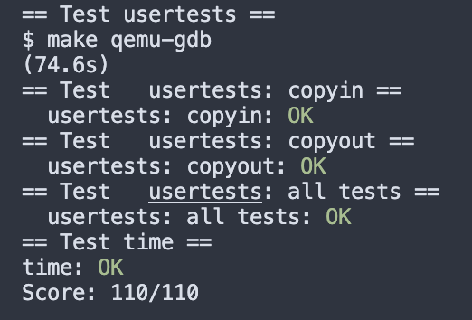

# Lab 6 COW 实验记录

lab completed, notes wip

Lab copy-on-write fork要求:

## 6.1 Implement copy-on write

### 1 要求

实现copy-on-write fork功能

### 2 实现

所有的diff

```c
diff --git a/.vscode/settings.json b/.vscode/settings.json
index 378db55..06f8036 100644
--- a/.vscode/settings.json
+++ b/.vscode/settings.json
@@ -4,7 +4,6 @@
         "typeinfo": "c",
         "param.h": "c",
         "types.h": "c",
-        "memlayout.h": "c",
-        "defs.h": "c"
+        "memlayout.h": "c"
     }
 }
\ No newline at end of file

    
diff --git a/kernel/defs.h b/kernel/defs.h
index b1d98c6..4b9bbc0 100644
--- a/kernel/defs.h
+++ b/kernel/defs.h
@@ -63,7 +63,6 @@ void            ramdiskrw(struct buf*);
 void*           kalloc(void);
 void            kfree(void *);
 void            kinit(void);
-void            incref(uint64);
 
 // log.c
 void            initlog(int, struct superblock*);
@@ -146,7 +145,6 @@ void            trapinit(void);
 void            trapinithart(void);
 extern struct spinlock tickslock;
 void            usertrapret(void);
-int             cowfault(pagetable_t, uint64);
 
 // uart.c
 void            uartinit(void);
@@ -173,7 +171,6 @@ uint64          walkaddr(pagetable_t, uint64);
 int             copyout(pagetable_t, uint64, char *, uint64);
 int             copyin(pagetable_t, char *, uint64, uint64);
 int             copyinstr(pagetable_t, char *, uint64, uint64);
-pte_t*         walk(pagetable_t, uint64, int);
 
 // plic.c
 void            plicinit(void);


diff --git a/kernel/kalloc.c b/kernel/kalloc.c
index 3a6f0d7..fa6a0ac 100644
--- a/kernel/kalloc.c
+++ b/kernel/kalloc.c
@@ -23,8 +23,6 @@ struct {
   struct run *freelist;
 } kmem;
 
-int refcount[PHYSTOP / PGSIZE]; // a number per page
-
 void
 kinit()
 {
@@ -37,21 +35,8 @@ freerange(void *pa_start, void *pa_end)
 {
   char *p;
   p = (char*)PGROUNDUP((uint64)pa_start);
-  for(; p + PGSIZE <= (char*)pa_end; p += PGSIZE) {
-    refcount[(uint64)p / PGSIZE] = 1;
+  for(; p + PGSIZE <= (char*)pa_end; p += PGSIZE)
     kfree(p);
-  }
-}
-// increment the reference count
-void
-incref(uint64 pa)
-{
-  int pn = pa / PGSIZE;
-  acquire(&kmem.lock);
-  if(pa >= PHYSTOP || refcount[pn] < 1)
-    panic("incref");
-  refcount[pn] += 1;
-  release(&kmem.lock);
 }
 
 // Free the page of physical memory pointed at by v,
@@ -66,19 +51,6 @@ kfree(void *pa)
   if(((uint64)pa % PGSIZE) != 0 || (char*)pa < end || (uint64)pa >= PHYSTOP)
     panic("kfree");
 
-  acquire(&kmem.lock);
-  int pn = (uint64)pa / PGSIZE;
-  if(refcount[pn] < 1)
-    panic("kfree");
-  refcount[pn] -= 1;
-  int tmp = refcount[pn];
-  release(&kmem.lock);
-
-  // free only when there is no ref pages
-  if (tmp > 0) {
-    return;
-  }
-
   // Fill with junk to catch dangling refs.
   memset(pa, 1, PGSIZE);
 
@@ -100,14 +72,8 @@ kalloc(void)
 
   acquire(&kmem.lock);
   r = kmem.freelist;
-  if(r) {
+  if(r)
     kmem.freelist = r->next;
-    int pn = (uint64) r/PGSIZE;
-    // init reference count
-    if(refcount[pn] != 0)
-      panic("kalloc ref");
-    refcount[pn] = 1;
-  }
   release(&kmem.lock);


diff --git a/kernel/trap.c b/kernel/trap.c
index 91fce7a..a63249e 100644
--- a/kernel/trap.c
+++ b/kernel/trap.c
@@ -29,37 +29,6 @@ trapinithart(void)
   w_stvec((uint64)kernelvec);
 }
 
-int
-cowfault(pagetable_t pagetable, uint64 va)
-{
-  if (va >= MAXVA)
-    return -1;
-
-  pte_t *pte = walk(pagetable, va, 0);
-  if (pte == 0)
-    return -1;
-
-  if((*pte & PTE_U) == 0 || (*pte & PTE_V) == 0)
-    return -1;
-  
-  uint64 pa1 = PTE2PA(*pte);
-  // alloc space for a new page
-  uint64 pa2 = (uint64) kalloc();
-  if(pa2 == 0){
-    printf("cow kalloc failed\n");
-    return -1;
-  }
-
-  // copy page from pa1 to pa2
-  memmove((void*)pa2, (void *)pa1, 4096);
-
-  kfree((void *)pa1); // now kfree will only free the page when the count < 1
-
-  *pte = PA2PTE(pa2) | PTE_V | PTE_U | PTE_R |PTE_W | PTE_X;
-
-  return 0;
-}
-
 //
 // handle an interrupt, exception, or system call from user space.
 // called from trampoline.S
@@ -96,9 +65,6 @@ usertrap(void)
     intr_on();
 
     syscall();
-  } else if (r_scause() == 0xf) {
-    if(cowfault(p->pagetable, r_stval()) < 0)
-      p->killed = 1;
   } else if((which_dev = devintr()) != 0){
     // ok
   } else {


diff --git a/kernel/vm.c b/kernel/vm.c
index 11d5a07..bccb405 100644
--- a/kernel/vm.c
+++ b/kernel/vm.c
@@ -311,7 +311,7 @@ uvmcopy(pagetable_t old, pagetable_t new, uint64 sz)
   pte_t *pte;
   uint64 pa, i;
   uint flags;
-  // char *mem;
+  char *mem;
 
   for(i = 0; i < sz; i += PGSIZE){
     if((pte = walk(old, i, 0)) == 0)
@@ -319,15 +319,14 @@ uvmcopy(pagetable_t old, pagetable_t new, uint64 sz)
     if((*pte & PTE_V) == 0)
       panic("uvmcopy: page not present");
     pa = PTE2PA(*pte);
-    *pte &= ~PTE_W;
     flags = PTE_FLAGS(*pte);
-    // if((mem = kalloc()) == 0)
-    //   goto err;
-    // memmove(mem, (char*)pa, PGSIZE);
-    if(mappages(new, i, PGSIZE, pa, flags) != 0){
+    if((mem = kalloc()) == 0)
+      goto err;
+    memmove(mem, (char*)pa, PGSIZE);
+    if(mappages(new, i, PGSIZE, (uint64)mem, flags) != 0){
+      kfree(mem);
       goto err;
     }
-    incref(pa);
   }
@@ -359,20 +358,9 @@ copyout(pagetable_t pagetable, uint64 dstva, char *src, uint64 len)
 
   while(len > 0){
     va0 = PGROUNDDOWN(dstva);
-
-    if (va0 >= MAXVA)
-      return -1;
-
-    pte_t *pte = walk(pagetable, va0, 0);
-    if(pte == 0 || (*pte & PTE_V) == 0 || (*pte & PTE_U) == 0)
+    pa0 = walkaddr(pagetable, va0);
+    if(pa0 == 0)
       return -1;
-
-    // check if its a cow page
-    if ((*pte & PTE_W) == 0){
-      if (cowfault(pagetable, va0) < 0)
-        return -1;
-    }
-    pa0 = PTE2PA(*pte);
     n = PGSIZE - (dstva - va0);
     if(n > len)
       n = len;
```


## Grade

