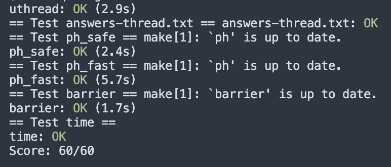

# Lab 7 thread 实验记录

lab completed, notes wip

## 7.1 Uthread: switching between threads

### 1 要求

修改 `thread_create()`, `thread_schedule()` 和`thread_swtich` ，实现线程切换

### 2 实现

选择先把create和schedule的实现细节完成，再去调用swich切换

- 在切换thread前需要保存当前thread context（callee-saved registers）

需要保存的寄存器和proc.h中的`struct context`是一样的，这里直接复制到了uthread.c。

相应地，既然每个thread都有自己的context，在thread结构体中也需要加入context变量

```c
// uthread.c
struct context {
  uint64 ra;
  uint64 sp;

  // callee-saved
  uint64 s0;
  uint64 s1;
  uint64 s2;
  uint64 s3;
  uint64 s4;
  uint64 s5;
  uint64 s6;
  uint64 s7;
  uint64 s8;
  uint64 s9;
  uint64 s10;
  uint64 s11;
};

struct thread {
  char       stack[STACK_SIZE]; /* the thread's stack */
  int        state;           /* FREE, RUNNING, RUNNABLE */
  struct context cntxt;  // saved registers of the thread

};
```

- 补完thread_create()，使得在创建一个线程时，把运行时需要的信息（func和它的thread stack）保存到其context中

```c
// uthread.c
void 
thread_create(void (*func)())
{
  struct thread *t;

  for (t = all_thread; t < all_thread + MAX_THREAD; t++) {
    if (t->state == FREE) break;
  }
  t->state = RUNNABLE;
  // YOUR CODE HERE
  t->cntxt.ra = (uint64)func;
  t->cntxt.sp = (uint64)t->stack + STACK_SIZE; // point to the top

}
```

- user/uthread_switch.S里添加thread_switch的汇编代码，因为context的保存在swtch.S里实现过了，所以可以直接复用

```assembly
// uthread_switch.S
thread_switch:
	/* YOUR CODE HERE */
	//  Swtch takes two arguments: 
	// struct context *old and struct context *new. 
	// It saves the current registers in old, 
	// loads registers from new, and returns.

	// saves cur regs into old context
	sd ra, 0(a0)
	sd sp, 8(a0)
	sd s0, 16(a0)
	sd s1, 24(a0)
	sd s2, 32(a0)
	sd s3, 40(a0)
	sd s4, 48(a0)
	sd s5, 56(a0)
	sd s6, 64(a0)
	sd s7, 72(a0)
	sd s8, 80(a0)
	sd s9, 88(a0)
	sd s10, 96(a0)
	sd s11, 104(a0)


	// loads regs from new context
	ld ra, 0(a1)
	ld sp, 8(a1)
	ld s0, 16(a1)
	ld s1, 24(a1)
	ld s2, 32(a1)
	ld s3, 40(a1)
	ld s4, 48(a1)
	ld s5, 56(a1)
	ld s6, 64(a1)
	ld s7, 72(a1)
	ld s8, 80(a1)
	ld s9, 88(a1)
	ld s10, 96(a1)
	ld s11, 104(a1)

	ret    /* return to ra */

```


- 完成以上的细节以后，再在thread_schedule()中调用thread_switch()切换线程

```c
void
thread_schedule(){
  // ...
  if (current_thread != next_thread) {
    // ... 切换thread == 把context替换掉
    thread_switch(&t->context, &current_thread->context);
  } else {
    next_thread = 0;
  }
}

```


## Grade

