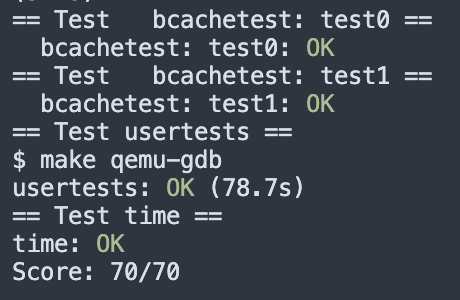

# Lab 8 lock 实验记录

lab finished, notes still wip

## 8.1 Memory Allocation

### 1 要求


### 2 实现


```shell
$ kalloctest
start test1
test1 results:
--- lock kmem/bcache stats
lock: kmem: #fetch-and-add 0 #acquire() 77224
lock: kmem: #fetch-and-add 0 #acquire() 188455
lock: kmem: #fetch-and-add 0 #acquire() 167395
lock: bcache: #fetch-and-add 0 #acquire() 468
--- top 5 contended locks:
lock: proc: #fetch-and-add 46780 #acquire() 92478
lock: proc: #fetch-and-add 39273 #acquire() 92481
lock: virtio_disk: #fetch-and-add 18315 #acquire() 57
lock: proc: #fetch-and-add 9429 #acquire() 92501
lock: proc: #fetch-and-add 4321 #acquire() 92480
tot= 0
test1 OK
start test2
total free number of pages: 32499 (out of 32768)
.....
test2 OK
```


## 8.2 Buffer cache

这题要求重构bcache（把linkedlist结构改为hashtable）。

涉及较大改动的部分包括：bcache的结构体、bget()、lru算法。其他还需要修改bio.c中涉及到的函数。

lru感觉还有待优化。目前的办法是遍历buckets中每个buffer的最近使用时间来确定lru buffer，但这样复杂度有O(N)。优化方法能想到两种：一个是用global优先队列保存lru buffer的信息，并且每次在buff in use时更新；另一个是在bucket head中保存该bucket的元信息，应该也可以节约一些遍历时间。

实现前：

```shell
$ bcachetest
start test0
test0 results:
--- lock kmem/bcache stats
lock: kmem: #fetch-and-add 0 #acquire() 33035
lock: bcache: #fetch-and-add 16142 #acquire() 65978
--- top 5 contended locks:
lock: virtio_disk: #fetch-and-add 162870 #acquire() 1188
lock: proc: #fetch-and-add 51936 #acquire() 73732
lock: bcache: #fetch-and-add 16142 #acquire() 65978
lock: uart: #fetch-and-add 7505 #acquire() 117
lock: proc: #fetch-and-add 6937 #acquire() 73420
tot= 16142
test0: FAIL
start test1
test1 OK
```

实现后：

```shell
$ bcachetest
start test0
test0 results:
--- lock kmem/bcache stats
lock: kmem: #fetch-and-add 0 #acquire() 32869
lock: kmem: #fetch-and-add 0 #acquire() 68
lock: kmem: #fetch-and-add 0 #acquire() 100
lock: bcache: #fetch-and-add 0 #acquire() 100
lock: bcache_hash: #fetch-and-add 0 #acquire() 70
lock: bcache_bucket: #fetch-and-add 0 #acquire() 6187
lock: bcache_bucket: #fetch-and-add 0 #acquire() 6180
lock: bcache_bucket: #fetch-and-add 0 #acquire() 6338
lock: bcache_bucket: #fetch-and-add 0 #acquire() 6472
lock: bcache_bucket: #fetch-and-add 0 #acquire() 6329
lock: bcache_bucket: #fetch-and-add 0 #acquire() 4255
lock: bcache_bucket: #fetch-and-add 0 #acquire() 4538
lock: bcache_bucket: #fetch-and-add 0 #acquire() 2221
lock: bcache_bucket: #fetch-and-add 0 #acquire() 5645
lock: bcache_bucket: #fetch-and-add 0 #acquire() 2216
lock: bcache_bucket: #fetch-and-add 0 #acquire() 4531
lock: bcache_bucket: #fetch-and-add 0 #acquire() 4173
lock: bcache_bucket: #fetch-and-add 0 #acquire() 6181
--- top 5 contended locks:
lock: virtio_disk: #fetch-and-add 442958 #acquire() 1149
lock: proc: #fetch-and-add 46827 #acquire() 72124
lock: proc: #fetch-and-add 8488 #acquire() 71802
lock: proc: #fetch-and-add 8360 #acquire() 71772
lock: proc: #fetch-and-add 6259 #acquire() 71802
tot= 0
test0: OK
start test1
test1 OK
```


## Grade

