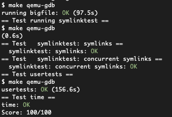

# Lab 9 file system 实验记录

lab link: https://pdos.csail.mit.edu/6.828/2020/labs/fs.html

## 9.1 Large files

### 1 要求

要求修改file system的block结构，使其支持doubly-indirect block，同时block上限从当前的$268 = 256 + 12$升高到 $65803 = 256*256 + 256 + 11$ 个blocks。

主要修改的函数是`bmap()`, `itrunc()`

### 2 实现

- 修改fs.h中定义的参数

```c
// fs.h
#define NDIRECT 11 // 原12 现在把其中一个block作为doubly
#define NINDIRECT (BSIZE / sizeof(uint))
#define NDOUBLE (NINDIRECT * NINDIRECT) // 定义doubly的容量
#define MAXFILE (NDIRECT + NINDIRECT + NDOUBLE) // 相应增加
```

- 相应修改inode和dinode的addrs数组大小

```c
// fs.h
struct dinode {
  // ...
  uint addrs[NDIRECT+2];   // 一共有11 + 1 + 1个block
};


// file.h
struct inode {
  // ...
  uint addrs[NDIRECT+2]; // 11 + 1 + 1
};
```

- 修改bmap函数

doubly indirect block相当于一个block指向了一个size=256的块，而每一块又指向一个size=256的block，所以最后一共增加了256*256 可用blocks。

只要在原有代码基础上增加分配中间层block内存的代码：

```c
// fs.c 附部分解释comment

static uint
bmap(struct inode *ip, uint bn)
{
  uint addr, *a, *a1;
  struct buf *bp;

  if(bn < NDIRECT){
    if((addr = ip->addrs[bn]) == 0)
      ip->addrs[bn] = addr = balloc(ip->dev);
    return addr;
  }
  bn -= NDIRECT;

  // if (bn >= 250) printf("bn: %d\n", bn);
  // 至此 bn=blocknumber=singly block中的计数 [0, 255]

  if(bn < NINDIRECT){
    // Load indirect block, allocating if necessary.
    // 给singly indirect block分配内存
    if((addr = ip->addrs[NDIRECT]) == 0)
      ip->addrs[NDIRECT] = addr = balloc(ip->dev);
    
    bp = bread(ip->dev, addr);
    a = (uint*)bp->data;
    if((addr = a[bn]) == 0){
      a[bn] = addr = balloc(ip->dev);
      log_write(bp);
    }
    brelse(bp);
    return addr;
  }
  // ++++++++++++++++++++++++以下新增++++++++++++++++++++
  bn -= NINDIRECT;
  // 至此 bn = doubly block中的计数 [0,65535]

  if(bn < NDOUBLE){
    // n1 = bn / NINDIRECT 中间层的block number/索引号
    // n2 = bn % NINDIRECT 实际的（最后一层）的block number
    // Load 1st layer of doubly indirect block, allocating if necessary.
    if((addr = ip->addrs[NDIRECT + 1]) == 0)
      ip->addrs[NDIRECT + 1] = addr = balloc(ip->dev);

    // Load 2nd layer of doubly indirect block. allocate if necessary
    bp = bread(ip->dev, addr);
    a = (uint*)bp->data;
    if((addr = a[bn / NINDIRECT]) == 0){
      a[bn / NINDIRECT] = addr = balloc(ip->dev);
      log_write(bp);
    }

    brelse(bp);

    // use block
    bp = bread(ip->dev, addr);
    a1 = (uint*)bp->data;
    if((addr = a1[bn % NINDIRECT]) == 0){
      a1[bn % NINDIRECT] = addr = balloc(ip->dev);
      log_write(bp);
    }

    brelse(bp);

    return addr;
  }
  
  panic("bmap: out of range");
}
```

- 相应地修改itrunc函数 用来释放内存

遍历中间层，释放其中每个block对应的第三层的内存blocks（增加一个嵌套循环），具体见下。

这里需要注意的是，因为要分别release不同层的buffer lock，所以各层不能像之前一样共用locked buffer pointer变量名（`bp`）。

```c
void
itrunc(struct inode *ip)
{
  int i, j, k;
  struct buf *bp, *bp2;
  uint *a, *a1;

  for(i = 0; i < NDIRECT; i++){
    if(ip->addrs[i]){
      bfree(ip->dev, ip->addrs[i]);
      ip->addrs[i] = 0;
    }
  }

  if(ip->addrs[NDIRECT]){
    // the bp of 256 blocks
    bp = bread(ip->dev, ip->addrs[NDIRECT]);
    // blocks addr arr
    a = (uint*)bp->data;
    // free every block in a
    for(j = 0; j < NINDIRECT; j++){
      if(a[j])
        bfree(ip->dev, a[j]);
    }
    brelse(bp);
    bfree(ip->dev, ip->addrs[NDIRECT]);
    ip->addrs[NDIRECT] = 0;
  }

  // ++++++++++++++++++++++++以下新增++++++++++++++++++++
  if(ip->addrs[NDIRECT + 1]){
    // the bp of 256 blocks
    bp = bread(ip->dev, ip->addrs[NDIRECT + 1]);
    // 1st addr arr
    a = (uint*)bp->data;
    // rls every blocks in every arr in a
    for(j = 0; j < NINDIRECT; j++){
      if(a[j]) {
        // 注意 bp2必须和bp区分开 否则会造成提前释放lock的问题
        bp2 = bread(ip->dev, a[j]); 
        a1 = (uint*)bp2->data;
        for (k = 0; k < NINDIRECT; k++){
          if (a1[k])
            bfree(ip->dev, a1[k]);
        }
        brelse(bp2);
        bfree(ip->dev, a[j]);
        a[j] = 0;
      }
    }

    brelse(bp);

    bfree(ip->dev, ip->addrs[NDIRECT + 1]);
    ip->addrs[NDIRECT + 1] = 0;
  }

  ip->size = 0;
  iupdate(ip);
}
```


## 9.2 Symbolic links

### 1 要求

实现`symlink(char *target, char *path)` system call

> You will implement the `symlink(char *target, char *path)` system call, which creates a new symbolic link at path that refers to file named by target. For further information, see the man page symlink. To test, add symlinktest to the Makefile and run it. Your solution is complete when the tests produce the following output (including usertests succeeding).

### 2 实现

- 设置syscall num、声明syscall函数等

按照hints里一个个来，涉及到文件：user/usys.pl, user/user.h,  kernel/syscall.h, kernel/syscall.c, 以及在kernel/sysfile.c里声明这个syscall函数（暂时为空）。

- kernel/stat.h 中增加T_SYMLINK，作为一个新的inode type

- kernel/fcntl.h中增加一个O_NOFOLLOW flag，和其他区分开，用来作为后续判断是否追踪symlink path的flag
- 实现symlink()

每个步骤都在注释里说明了，可以参考sys_link的实现。主要涉及到：1）创建一个特殊类型的inode（type=sym），它的路径和传入的`path`（下面命名为source以防搞混）相同；2）然后在inode里存放target path。

```c
// sysfile.c


uint64
sys_symlink(void)
{
  // symlink("/testsymlink/b", "/testsymlink/a");
  // arg0 target pathname
  // arg1 path pathname

  char source[MAXPATH], target[MAXPATH];
  struct inode *sip;
  int len;

  // load args
  if((len = argstr(0, target, MAXPATH)) < 0 || argstr(1, source, MAXPATH) < 0)
    return -1;

  begin_op();
  // create a symnode to store target
  sip = create(source, T_SYMLINK, 0, 0);
  if(sip == 0){
    end_op();
    return -1;
  }

  // ilock(sip); deadlock create里已经lock了
  // write the target path to symnode
  if (writei(sip, 0, (uint64)target, 0, len) != len) {
    iunlockput(sip);
    end_op();
    return -1;
  }
  iunlockput(sip);

  end_op();

  return 0;
}
```


- 修改sys_open()。

需要实现：如果当前path指向一个symlink inode，根据O_NOFOLLOW决定是否要跟踪symlink中的target path。

如果跟踪，用link depth进行环检测+及时终止跟踪；

如果不跟踪，直接读取该symnode（即不用额外操作）。

```c
// sysfile.c

// 主要步骤见comment 具体略
struct inode*
getirec(struct inode *ip) {
  uint inums[10]; // prompt建议设置最大深度为10 超过10默认err
  int i, j;
  char target[MAXPATH];

  for(i = 0; i < 10; i++) {
    inums[i] = ip->inum;
    // read the target path from symlink file
    // 用readi 略
    
    // get the inode of target path 
    if((ip = namei(target)) == 0) {
      return 0;
    }
	// ...
    // 判断是否为symnode 不是则直接返回ip 是则继续跟踪path
    if(ip->type != T_SYMLINK) {
      return ip;
    }
  }

  iunlockput(ip);
  return 0;
}

uint64
sys_open(void)
{
  char path[MAXPATH];
  int fd, omode;
  struct file *f;
  struct inode *ip;
  int n;
  // ...

  if(ip->type == T_DEVICE && (ip->major < 0 || ip->major >= NDEV)){
    iunlockput(ip);
    end_op();
    return -1;
  }
  // ++++++++++++ 以下新增 ++++++++++++++++
  // if inode is a symnode
  if (ip->type == T_SYMLINK && (omode & O_NOFOLLOW) == 0) {
    // if symnode not marked NOFOLLOW, read recursively
      // getirec需要额外写一下（略） 根据promt 不建议写成递归
      if ((ip = getirec(ip)) == 0) {
        end_op();
        return -1;
      }
  // ...
  }
```


## Grade

